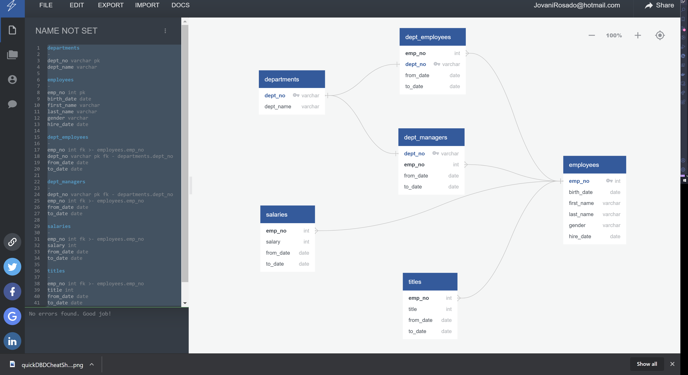

# Pewlett Hackard Analysis

> Design an ERD for a fictions company.

## Overview of Project

> Data Modeling, Engineering, and Analysis

We needed to determine the number of retiring employees per title and identify employees who are eligible to participate in a mentorship program to train new employees. By using a SQL database, creating entity relationship diagrams (ERDs), import and export large CSV datasets.

## Summary

We did research analysis on employees of Pewlett Hackard Corporation and find answers to the questions of what to do when our employees start to retire in droves. We have six CSVs, each containing different data that we will import into Postgres and run SQL scripts against that data.

We made entity relationship diagrams (ERDs):

The image above shows the connections between the datasets through primary and foreign keys. This process of **Data Modeling**. The understanding of the data we're working with and finding the connections. QuickDBD webapp allowed us to create a map of the database ... [https://app.quickdatabasediagrams.com/#/d/yGbzmJ](https://app.quickdatabasediagrams.com/#/d/yGbzmJ)

In the **Data Engineering** we used the model in QuickDBD to export a sql schema file saved in our resources folder. We created a table schema for each of the six CSV files, specified data types, primary keys, foreign keys, and other constraints. Imported the six CSV files into their corresponding SQL tables.

**Data Analysis**

- Determine Retirement Eligibility: Bobby's boss has determined that anyone born between 1952 and 1955 will begin to retire. The first query we need to help Bobby write will return a list of those employees.

- Create another query that will search for only 1952 birth dates.

- Bobby's been asked to dive back into SQL and create a separate list of employees for each department.

- Now that we have a list of all retirement-eligible employees by joining retirement_info and dept_emp tables and we created the retirement_info.csv from the analysis.

### Resources

Quick DBD Physical Diagrams Connections
PostgreSQL
CSV Files:

- departments.csv
- dept_emp.csv
- dept_manager.csv
- employees.csv
- salaries.csv
- titles.csv

### Results / Analysis

From Mentorship Eligibility CSV we have 1549 available employees for the mentorship program.

From Unique Titles CSV we have 90,398 employees that will be retiring.

## Todo Checklist

A helpful checklist to gauge how your README is coming on what I would like to finish:

- [ ] Covert my SQL scripts and workflow to Pandas in pewlett-hackard-analysis.ipynb

## Contributing

Pull requests are welcome. For major changes, please open an issue first to discuss what you would like to change.

Please make sure to update tests as appropriate.

## License

[MIT](https://choosealicense.com/licenses/mit/)
